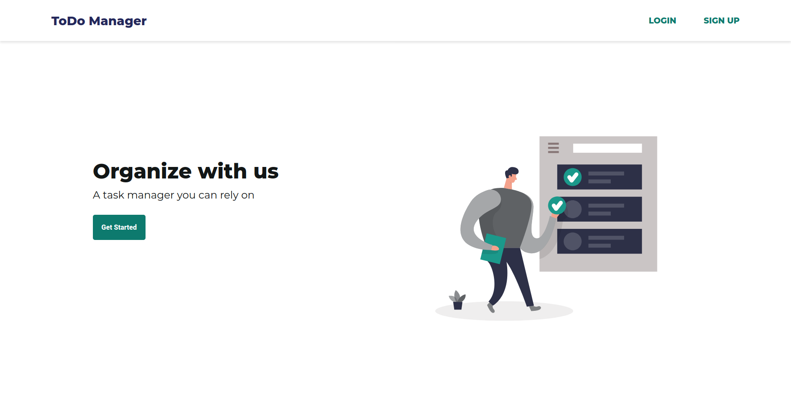
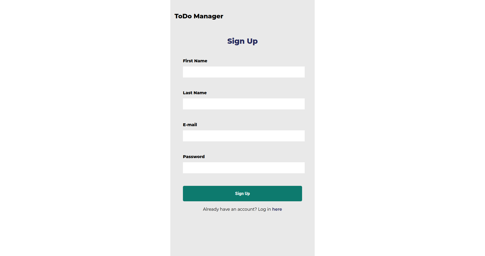
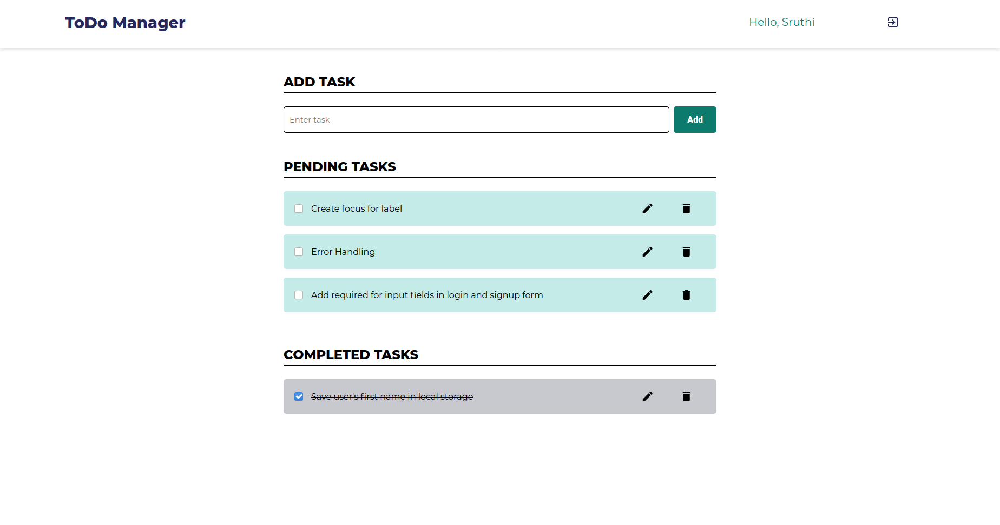

# ToDo Manager

A responsive **MERN** stack application for maintaining daily tasks.

 

    
    <strong>Home page</strong>

 

    
    <strong>Login page</strong>

 

    
    <strong>Sign up page</strong>

 

    
    <strong>Tasks page</strong>

